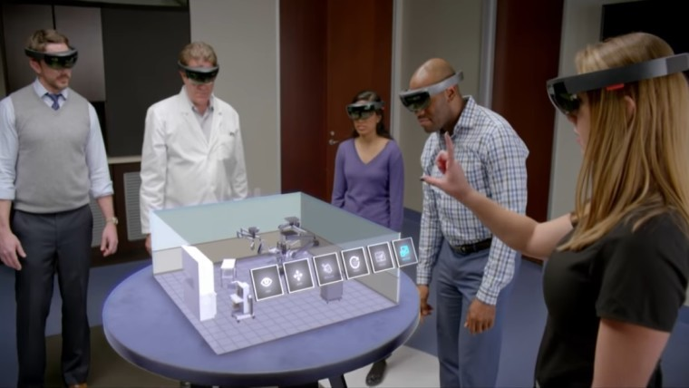
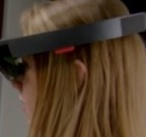

# ImageAI : Custom Object Detection

An **DeepQuest AI** project [https://deepquestai.com](https://deepquestai.com)

---


### TABLE OF CONTENTS

- <a href="#customdetection" >&#9635 Custom Object Detection</a>
- <a href="#objectextraction" >&#9635 Object Detection, Extraction and Fine-tune</a>
- <a href="#hidingdetails" >&#9635 Hiding/Showing Object Name and Probability</a>
- <a href="#inputoutputtype" >&#9635 Image Input & Output Types</a>
- <a href="#documentation" >&#9635 Documentation</a>


ImageAI provides very convenient and powerful methods to perform object detection on images and extract each object from the image using your own **custom YOLOv3 model** and the corresponding **detection_config.json** generated during the training. To test the custom object detection, you can download a sample custom model we have trained to detect the Hololens headset and its **detection_config.json** file via the links below:

* [**hololens-ex-60--loss-2.76.h5**](https://github.com/OlafenwaMoses/ImageAI/releases/download/essential-v4/hololens-ex-60--loss-2.76.h5) _(Size = 236 mb)_
* [**detection_config.json**](https://github.com/OlafenwaMoses/ImageAI/releases/download/essential-v4/detection_config.json)


 Once you download the custom object detection model file, you should copy the model file to the your project folder where your **.py** files will be.
 Then create a python file and give it a name; an example is FirstCustomDetection.py. Then write the code below into the python file: 

### FirstCustomDetection.py
<div id="customdetection" ></div>

```python
from imageai.Detection.Custom import CustomObjectDetection

detector = CustomObjectDetection()
detector.setModelTypeAsYOLOv3()
detector.setModelPath("hololens-ex-60--loss-2.76.h5")
detector.setJsonPath("detection_config.json")
detector.loadModel()
detections = detector.detectObjectsFromImage(input_image="holo2.jpg", output_image_path="holo2-detected.jpg")
for detection in detections:
    print(detection["name"], " : ", detection["percentage_probability"], " : ", detection["box_points"])

```

Sample Result - Input:

  Output: 

          
```
hololens  :  39.69653248786926  :  [611, 74, 751, 154]
hololens  :  87.6643180847168  :  [23, 46, 90, 79]
hololens  :  89.25175070762634  :  [191, 66, 243, 95]
hololens  :  64.49641585350037  :  [437, 81, 514, 133]
hololens  :  91.78624749183655  :  [380, 113, 423, 138]

```


Let us make a breakdown of the object detection code that we used above.

```python
from imageai.Detection.Custom import CustomObjectDetection

detector = CustomObjectDetection()
detector.setModelTypeAsYOLOv3()
```
 In the 3 lines above , we import the **ImageAI custom object detection** class in the first line, created the class instance on the second line and set the model type to YOLOv3.
```
detector.setModelPath("hololens-ex-60--loss-2.76.h5")
detector.setJsonPath("detection_config.json")
detector.loadModel()
```
  In the 3 lines above, we specified the file path to our downloaded model file in the first line , specified the path to our **detection_config.json** file in the second line and loaded the model on the third line.

```python
detections = detector.detectObjectsFromImage(input_image="holo2.jpg", output_image_path="holo2-detected.jpg")
for detection in detections:
    print(detection["name"], " : ", detection["percentage_probability"], " : ", detection["box_points"])

```

In the 3 lines above, we ran the `detectObjectsFromImage()` function and parse in the path to our test image, and the path to the new
 image which the function will save. Then the function returns an array of dictionaries with each dictionary corresponding
 to the number of objects detected in the image. Each dictionary has the properties `name` (name of the object),
`percentage_probability` (percentage probability of the detection) and `box_points` (the x1,y1,x2 and y2 coordinates of the bounding box of the object). 


###  Object Detection, Extraction and Fine-tune
<div id="objectextraction" ></div>

In the examples we used above, we ran the object detection on an image and it
returned the detected objects in an array as well as save a new image with rectangular markers drawn on each object. In our next examples, we will be able to extract each object from the input image and save it independently.
  
  

In the example code below which is very identical to the previous object detection code, we will save each object detected as a separate image.

```python
from imageai.Detection.Custom import CustomObjectDetection

detector = CustomObjectDetection()
detector.setModelTypeAsYOLOv3()
detector.setModelPath("hololens-ex-60--loss-2.76.h5")
detector.setJsonPath("detection_config.json") 
detector.loadModel()
detections, extracted_objects_array = detector.detectObjectsFromImage(input_image="holo2.jpg", output_image_path="holo2-detected.jpg", extract_detected_objects=True)

for detection, object_path in zip(detections, extracted_objects_array):
    print(object_path)
    print(detection["name"], " : ", detection["percentage_probability"], " : ", detection["box_points"])
    print("---------------")
```


Sample Result: Output Images
    





Let us review the part of the code that perform the object detection and extract the images:

```python
detections, extracted_objects_array = detector.detectObjectsFromImage(input_image="holo2.jpg", output_image_path="holo2-detected.jpg", extract_detected_objects=True)

for detection, object_path in zip(detections, extracted_objects_array):
    print(object_path)
    print(detection["name"], " : ", detection["percentage_probability"], " : ", detection["box_points"])
    print("---------------")
```

In the above above lines, we called the `detectObjectsFromImage()` , parse in the input image path, output image part, and an
extra parameter `extract_detected_objects=True`. This parameter states that the function should extract each object detected from the image
and save it has a seperate image. The parameter is false by default. Once set to `true`, the function will create a directory
 which is the `output image path + "-objects"`. Then it saves all the extracted images into this new directory with
  each image's name being the `detected object name + "-" + a number` which corresponds to the order at which the objects
  were detected.
  
This new parameter we set to extract and save detected objects as an image will make the function to return 2 values. The
 first is the array of dictionaries with each dictionary corresponding to a detected object. The second is an array of the paths
  to the saved images of each object detected and extracted, and they are arranged in order at which the objects are in the
  first array.

  

### And one important feature you need to know!

You will recall that the percentage probability
   for each detected object is sent back by the `detectObjectsFromImage()` function. The function has a parameter
   `minimum_percentage_probability` , whose default value is `30` (value ranges between 0 - 100) , but it set to 30 in this example. That means the function will only return a detected
    object if it's percentage probability is **30 or above**. The value was kept at this number to ensure the integrity of the
     detection results. You fine-tune the object
      detection by setting `minimum_percentage_probability` equal to a smaller value to detect more number of objects or higher value to detect less number of objects.


###  Hiding/Showing Object Name and Probability
<div id="hidingdetails"></div>

**ImageAI** provides options to hide the name of objects detected and/or the percentage probability from being shown on the saved/returned detected image. Using the `detectObjectsFromImage()` and `detectCustomObjectsFromImage()` functions, the parameters `'display_object_name'` and `'display_percentage_probability'`  can be set to True of False individually. Take a look at the code below: 
```python
detections = detector.detectObjectsFromImage(input_image=os.path.join(execution_path , "holo2.jpg"), output_image_path=os.path.join(execution_path , "holo2_nodetails.jpg"), minimum_percentage_probability=30, display_percentage_probability=False, display_object_name=False)
```

In the above code, we specified that both the object name and percentage probability should not be shown. As you can see in the result below, both the names of the objects and their individual percentage probability is not shown in the detected image. 

**Result**


### Image Input & Output Types
<div id="inputoutputtype"></div>

**ImageAI** custom object detection supports 2 input types of inputs which are **file path to image file**(default) and **numpy array of an image**
as well as 2 types of output which are image **file**(default) and numpy **array **.
This means you can now perform object detection in production applications such as on a web server and system
 that returns file in any of the above stated formats.
 To perform object detection with numpy array input, you just need to state the input type
in the `.detectObjectsFromImage()` function. See example below.

```python
detections = detector.detectObjectsFromImage(input_type="array", input_image=image_array , output_image_path=os.path.join(execution_path , "holo2-detected.jpg")) # For numpy array input type
```
To perform object detection with numpy array output you just need to state the output type
in the `.detectObjectsFromImage()` function. See example below.

```python
detected_image_array, detections = detector.detectObjectsFromImage(output_type="array", input_image="holo2.jpg" ) # For numpy array output type
```


### Documentation
<div id="documentation" ></div>

We have provided full documentation for all **ImageAI** classes and functions in 3 major languages. Find links below: 

* Documentation - **English Version**  [https://imageai.readthedocs.io](https://imageai.readthedocs.io)** 
* Documentation - **Chinese Version**  [https://imageai-cn.readthedocs.io](https://imageai-cn.readthedocs.io)**
* Documentation - **French Version**  [https://imageai-fr.readthedocs.io](https://imageai-fr.readthedocs.io)**
