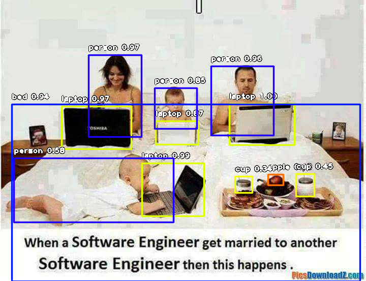
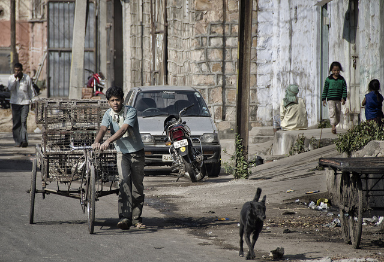
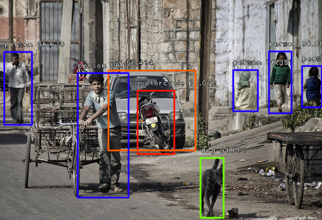
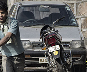
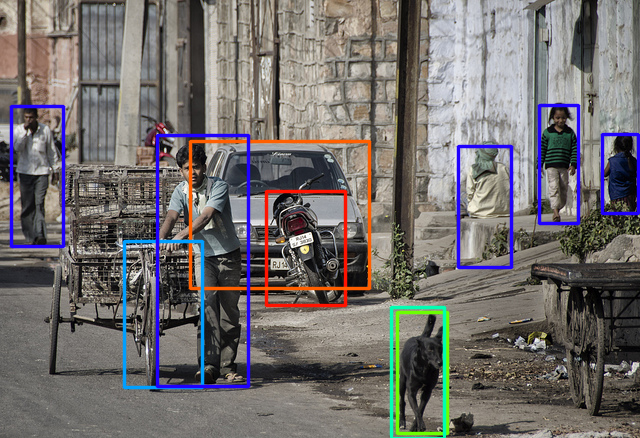

# ImageAI : Object Detection

A **DeepQuest AI** project [https://deepquestai.com](https://deepquestai.com)

### TABLE OF CONTENTS

- <a href="#firstdetection" > :white_square_button: First Object Detection</a>
- <a href="#objectextraction" > :white_square_button: Object Detection, Extraction and Fine-tune</a>
- <a href="#customdetection" > :white_square_button: Custom Object Detection</a>
- <a href="#detectionspeed" > :white_square_button: Detection Speed</a>
- <a href="#hidingdetails" > :white_square_button: Hiding/Showing Object Name and Probability</a>
- <a href="#inputoutputtype" > :white_square_button: Image Input & Output Types</a>
- <a href="#documentation" > :white_square_button: Documentation</a>


ImageAI provides very convenient and powerful methods to perform object detection on images and extract each object from the image. The object detection class supports RetinaNet, YOLOv3 and TinyYOLOv3. To start performing object detection, you must download the RetinaNet, YOLOv3 or TinyYOLOv3 object detection model via the links below: 
* **[RetinaNet](https://github.com/OlafenwaMoses/ImageAI/releases/download/essentials-v5/resnet50_coco_best_v2.1.0.h5)** _(Size = 145 mb, high performance and accuracy, with longer detection time)_
* **[YOLOv3](https://github.com/OlafenwaMoses/ImageAI/releases/download/1.0/yolo.h5)** _(Size = 237 mb, moderate performance and accuracy, with a moderate detection time)_
* **[TinyYOLOv3](https://github.com/OlafenwaMoses/ImageAI/releases/download/1.0/yolo-tiny.h5)** _(Size = 34 mb, optimized for speed and moderate performance, with fast detection time)_


 Once you download the object detection model file, you should copy the model file to the your project folder where your .py files will be.
 Then create a python file and give it a name; an example is FirstObjectDetection.py. Then write the code below into the python file:

### FirstObjectDetection.py
<div id="firstdetection" ></div>

```python
from imageai.Detection import ObjectDetection
import os

execution_path = os.getcwd()

detector = ObjectDetection()
detector.setModelTypeAsYOLOv3()
detector.setModelPath( os.path.join(execution_path , "yolo.h5"))
detector.loadModel()
detections = detector.detectObjectsFromImage(input_image=os.path.join(execution_path , "image2.jpg"), output_image_path=os.path.join(execution_path , "image2new.jpg"), minimum_percentage_probability=30)

for eachObject in detections:
    print(eachObject["name"] , " : ", eachObject["percentage_probability"], " : ", eachObject["box_points"] )
    print("--------------------------------")
```

Sample Result:
Input Image

Output Image


```
laptop  :  87.32235431671143  :  (306, 238, 390, 284)
--------------------------------
laptop  :  96.86298966407776  :  (121, 209, 258, 293)
--------------------------------
laptop  :  98.6301600933075  :  (279, 321, 401, 425)
--------------------------------
laptop  :  99.78572130203247  :  (451, 204, 579, 285)
--------------------------------
bed  :  94.02391314506531  :  (23, 205, 708, 553)
--------------------------------
apple  :  48.03136885166168  :  (527, 343, 557, 364)
--------------------------------
cup  :  34.09906327724457  :  (462, 347, 496, 379)
--------------------------------
cup  :  44.65090036392212  :  (582, 342, 618, 386)
--------------------------------
person  :  57.70219564437866  :  (27, 311, 341, 437)
--------------------------------
person  :  85.26121377944946  :  (304, 173, 387, 253)
--------------------------------
person  :  96.33603692054749  :  (415, 130, 538, 266)
--------------------------------
person  :  96.95255160331726  :  (174, 108, 278, 269)
--------------------------------
```

Let us make a breakdown of the object detection code that we used above.

```python
from imageai.Detection import ObjectDetection
import os

execution_path = os.getcwd()
```

 In the 3 lines above , we import the **ImageAI object detection** class in the first line, import the `os` in the second line and obtained the path to folder where our python file runs.
  
```python
detector = ObjectDetection()
detector.setModelTypeAsYOLOv3()
detector.setModelPath( os.path.join(execution_path , "yolo.h5"))
detector.loadModel()
```

In the 4 lines above, we created a new instance of the `ObjectDetection` class in the first line, set the model type to YOLOv3 in the second line, set the model path to the YOLOv3 model file we downloaded and copied to the python file folder in the third line and load the model in the fourth line.

```python
detections = detector.detectObjectsFromImage(input_image=os.path.join(execution_path , "image2.jpg"), output_image_path=os.path.join(execution_path , "image2new.jpg"))

for eachObject in detections:
    print(eachObject["name"] , " : ", eachObject["percentage_probability"], " : ", eachObject["box_points"] )
    print("--------------------------------")
```

In the 2 lines above, we ran the `detectObjectsFromImage()` function and parse in the path to our image, and the path to the new image which the function will save. Then the function returns an array of dictionaries with each dictionary corresponding to the number of objects detected in the image. Each dictionary has the properties `name` (name of the object), `percentage_probability` (percentage probability of the detection) and `box_points` (the x1,y1,x2 and y2 coordinates of the bounding box of the object).

Should you want to use the RetinaNet which is appropriate for high-performance and high-accuracy demanding detection tasks, you will download the RetinaNet model file from the links above, copy it to your python file's folder, set the model type and model path in your python code as seen below:

```python
detector = ObjectDetection()
detector.setModelTypeAsRetinaNet()
detector.setModelPath( os.path.join(execution_path , "resnet50_coco_best_v2.0.1.h5"))
detector.loadModel()
```

However, if you desire TinyYOLOv3 which is optimized for speed and embedded devices, you will download the TinyYOLOv3 model file from the links above, copy it to your python file's folder, set the model type and model path in your python code as seen below:

```python
detector = ObjectDetection()
detector.setModelTypeAsTinyYOLOv3()
detector.setModelPath( os.path.join(execution_path , "yolo-tiny.h5"))
detector.loadModel()
```

## Object Detection, Extraction and Fine-tune
<div id="objectextraction" ></div>

In the examples we used above, we ran the object detection on an image and it returned the detected objects in an array as well as save a new image with rectangular markers drawn on each object. In our next examples, we will be able to extract each object from the input image
  and save it independently.

In the example code below which is very identical to the previous object detction code, we will save each object detected as a seperate image.

```python
from imageai.Detection import ObjectDetection
import os

execution_path = os.getcwd()

detector = ObjectDetection()
detector.setModelTypeAsYOLOv3()
detector.setModelPath( os.path.join(execution_path , "yolo.h5"))
detector.loadModel()

detections, objects_path = detector.detectObjectsFromImage(input_image=os.path.join(execution_path , "image3.jpg"), output_image_path=os.path.join(execution_path , "image3new.jpg"), minimum_percentage_probability=30,  extract_detected_objects=True)

for eachObject, eachObjectPath in zip(detections, objects_path):
    print(eachObject["name"] , " : " , eachObject["percentage_probability"], " : ", eachObject["box_points"] )
    print("Object's image saved in " + eachObjectPath)
    print("--------------------------------")
```








Let us review the part of the code that perform the object detection and extract the images:

```python
detections, objects_path = detector.detectObjectsFromImage(input_image=os.path.join(execution_path , "image3.jpg"), output_image_path=os.path.join(execution_path , "image3new.jpg"), minimum_percentage_probability=30,  extract_detected_objects=True)

for eachObject, eachObjectPath in zip(detections, objects_path):
    print(eachObject["name"] , " : " , eachObject["percentage_probability"], " : ", eachObject["box_points"] )
    print("Object's image saved in " + eachObjectPath)
    print("--------------------------------")
```

In the above above lines, we called the `detectObjectsFromImage()` , parse in the input image path, output image part, and an extra parameter `extract_detected_objects=True`. This parameter states that the function should extract each object detected from the image and save it has a seperate image. The parameter is false by default. Once set to `true`, the function will create a directory which is the **output image path + "-objects"** . Then it saves all the extracted images into this new directory with each image's name being the **detected object name + "-" + a number** which corresponds to the order at which the objects were detected.

This new parameter we set to extract and save detected objects as an image will make the function to return 2 values. The first is the array of dictionaries with each dictionary corresponding to a detected object. The second is an array of the paths to the saved images of each object detected and extracted, and they are arranged in order at which the objects are in the first array.


**And one important feature you need to know!** You will recall that the percentage probability
   for each detected object is sent back by the `detectObjectsFromImage()` function. The function has a parameter `minimum_percentage_probability`, whose default value is `50` (value ranges between 0 - 100) , but it set to 30 in this example. That means the function will only return a detected object if it's percentage probability is **30 or above**. The value was kept at this number to ensure the integrity of the detection results. You fine-tune the object detection by setting **minimum_percentage_probability** equal to a smaller value to detect more number of objects or higher value to detect less number of objects.


## Custom Object Detection
<div id="customdetection" ></div>

The object detection model (**RetinaNet**) supported by **ImageAI** can detect 80 different types of objects. They include:
```
person,  bicycle,  car, motorcycle, airplane, bus, train,  truck,  boat,  traffic light,  fire hydrant, stop_sign,
parking meter,   bench,   bird,   cat,   dog,   horse,   sheep,   cow,   elephant,   bear,   zebra,
giraffe,   backpack,   umbrella,   handbag,   tie,   suitcase,   frisbee,   skis,   snowboard,
sports ball,   kite,   baseball bat,   baseball glove,   skateboard,   surfboard,   tennis racket,
bottle,   wine glass,   cup,   fork,   knife,   spoon,   bowl,   banana,   apple,   sandwich,   orange,
broccoli,   carrot,   hot dog,   pizza,   donot,   cake,   chair,   couch,   potted plant,   bed,
dining table,   toilet,   tv,   laptop,   mouse,   remote,   keyboard,   cell phone,   microwave,   oven,
toaster,   sink,   refrigerator,   book,   clock,   vase,   scissors,   teddy bear,   hair dryer,   toothbrush.
```

Interestingly, **ImageAI** allow you to perform detection for one or more of the items above. That means you can
 customize the type of object(s) you want to be detected in the image. Let's take a look at the code below:

```python
from imageai.Detection import ObjectDetection
import os

execution_path = os.getcwd()

detector = ObjectDetection()
detector.setModelTypeAsYOLOv3()
detector.setModelPath( os.path.join(execution_path , "yolo.h5"))
detector.loadModel()

custom_objects = detector.CustomObjects(car=True, motorcycle=True)
detections = detector.detectCustomObjectsFromImage(custom_objects=custom_objects, input_image=os.path.join(execution_path , "image3.jpg"), output_image_path=os.path.join(execution_path , "image3custom.jpg"), minimum_percentage_probability=30)

for eachObject in detections:
    print(eachObject["name"] , " : ", eachObject["percentage_probability"], " : ", eachObject["box_points"] )
    print("--------------------------------")
```


Let us take a look at the part of the code that made this possible.
```python
custom_objects = detector.CustomObjects(car=True, motorcycle=True)
detections = detector.detectCustomObjectsFromImage(custom_objects=custom_objects, input_image=os.path.join(execution_path , "image3.jpg"), output_image_path=os.path.join(execution_path , "image3custom.jpg"), minimum_percentage_probability=30)
```

In the above code, after loading the model (can be done before loading the model as well), we defined a new variable
`custom_objects = detector.CustomObjects()`, in which we set its car and motorcycle properties equal to **True**.
This is to tell the model to detect only the object we set to True. Then we call the `detector.detectCustomObjectsFromImage()`
which is the function that allows us to perform detection of custom objects. Then we will set the `custom_objects` value
 to the custom objects variable we defined.


## Detection Speed
<div id="detectionspeed"></div>

**ImageAI** now provides detection speeds for all object detection tasks. The detection speeds allow you to reduce
 the time of detection at a rate between 20% - 80%, and yet having just slight changes but accurate detection
results. Coupled with lowering the `minimum_percentage_probability` parameter, detections can match the normal
speed and yet reduce detection time drastically. The available detection speeds are **"normal"**(default), **"fast"**, **"faster"** , **"fastest"** and **"flash"**.
All you need to do is to state the speed mode you desire when loading the model as seen below.

```python
detector.loadModel(detection_speed="fast")
```


## Hiding/Showing Object Name and Probability
<div id="hidingdetails"></div>

**ImageAI** provides options to hide the name of objects detected and/or the percentage probability from being shown on the saved/returned detected image. Using the `detectObjectsFromImage()` and `detectCustomObjectsFromImage()` functions, the parameters `display_object_name` and `display_percentage_probability`  can be set to True of False individually. Take a look at the code below:

```python
detections = detector.detectObjectsFromImage(input_image=os.path.join(execution_path , "image3.jpg"), output_image_path=os.path.join(execution_path , "image3new_nodetails.jpg"), minimum_percentage_probability=30, display_percentage_probability=False, display_object_name=False)
```

In the above code, we specified that both the object name and percentage probability should not be shown. As you can see in the result below, both the names of the objects and their individual percentage probability is not shown in the detected image.




## Image Input & Output Types
<div id="inputoutputtype"></div>

**ImageAI** supports 3 input types of inputs which are **file path to image file**(default), **numpy array of image** and **image file stream**
as well as 2 types of output which are image **file**(default) and numpy  **array **.
This means you can now perform object detection in production applications such as on a web server and system
 that returns file in any of the above stated formats.

To perform object detection with numpy array or file stream input, you just need to state the input type
in the `.detectObjectsFromImage()` function or the `.detectCustomObjectsFromImage()` function. See example below.

```python
detections = detector.detectObjectsFromImage(input_type="array", input_image=image_array , output_image_path=os.path.join(execution_path , "image.jpg")) # For numpy array input type
detections = detector.detectObjectsFromImage(input_type="stream", input_image=image_stream , output_image_path=os.path.join(execution_path , "test2new.jpg")) # For file stream input type
```

To perform object detection with numpy array output you just need to state the output type
in the `.detectObjectsFromImage()` function or the `.detectCustomObjectsFromImage()` function. See example below.

```python
detected_image_array, detections = detector.detectObjectsFromImage(output_type="array", input_image="image.jpg" ) # For numpy array output type
```


## Documentation
<div id="documentation" ></div>

We have provided full documentation for all **ImageAI** classes and functions in 3 major languages. Find links below:

* Documentation - **English Version  [https://imageai.readthedocs.io](https://imageai.readthedocs.io)**
* Documentation - **Chinese Version  [https://imageai-cn.readthedocs.io](https://imageai-cn.readthedocs.io)**
* Documentation - **French Version  [https://imageai-fr.readthedocs.io](https://imageai-fr.readthedocs.io)**
